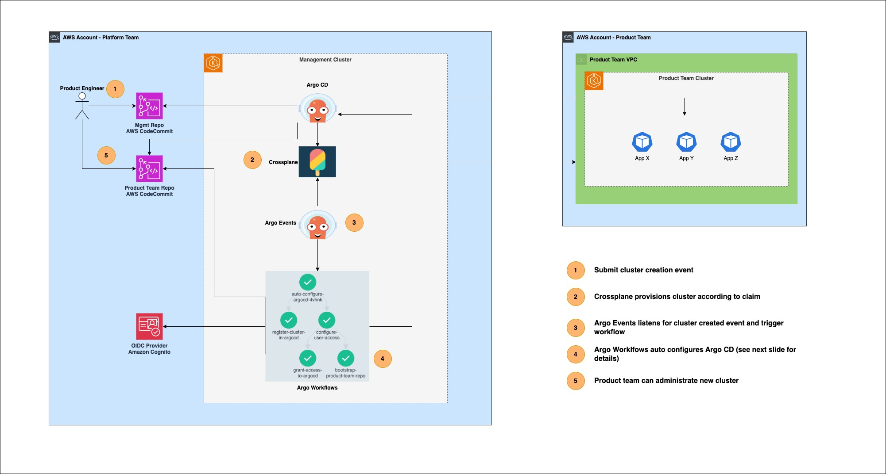
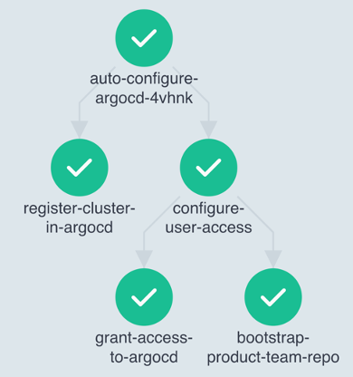

# Empower Developers with GitOps-Driven Kubernetes Cluster Provisioning

This repository provides an architectural pattern which enables platform teams to automate the registration and configuration of new Kubernetes clusters into their central GitOps platform.

> ⚠️ Please note that this repository contains code snippets of an architectural pattern explained in conference talks. The repository does not provide end-to-end instructions how to setup the bespoken solution.

## Talks

This pattern has been presented at KubeCon+CloudNativeCon North America 2023 (Chicago), GitOpsCon Europe 2023 (Virtual), KubeCon+CloudNativeCon Europe 2024 (Paris) and GitOpsCon North America 2024 (Seattle). Please have a look at the recordings below which provide an in-depth explanation of the pattern along with a demo.

GitOpsCon Europe 2023           |  GitOpsCon North America 2024
:-------------------------:|:-------------------------:
[](https://www.youtube.com/watch?v=eQ_JbSLYUPI&pp=ygUPdmFsZW50aW4gd2lkbWVy)  |  [](https://www.youtube.com/watch?app=desktop&v=QZDA-8R4CyE&list=PLj6h78yzYM2OyAZIMbJPOsamT2aLKZX6b&index=7)
## Architecture



1) Product Engineer creates a pull request to request a new EKS cluster by specifying a Crossplane Cluster composition. This composition is synced by the central Argo CD instance into the Management Cluster. Requests are reviewed centrally by members of the platform team. 
2) Crossplane provisions an Amazon VPC and the corresponding EKS cluster into the Product Team account. Once the cluster has been deployed successfully, Crossplane is deploying a Config Map with related metadata (e.g. product team name, target AWS account id) about the new cluster into the Management Cluster. The snippet below describes the bespoken Config Map:
    ```yaml
    apiVersion: v1
    kind: ConfigMap
    metadata:
    name: cluster-creation-event
    namespace: crossplane-system
    data:
    clusterName: crossplane-production-cluster-bxv85 # Name of the provisioned cluster
    productTeamAccountId: "<AWS_ACCOUNT_ID>" # AWS Account Id of the spoke account
    productTeamName: product-team-a # Name of the product team (will be the name of the group created in Cognito)
    productTeamMembers: "mtest,kfoo,bzert" # Comma delimited list of IdP users
    ```
3) Argo Events listen for the creation of the metadata Config Map and triggers the Argo Workflow. 
4) The Argo Workflow is peforming the following steps to wire up the provisioned cluster with the central Argo CD instance

    

    -  **register-cluster-in-argocd** 
            
        Allow Argo CD to manage resources in the new cluster 

    - **configure-user-access**
    
        Create dedicated group in Amazon Cognito and add users from product team. This allows members of the product team to access Argo CD through the UI

    -  **grant-access-to-argocd**
    
        Ensure that product team only have access to their applications and clusters. 

    -  **bootstrap-product-team-repo**
        
        Create dedicated Code Commit repository for the product team which allows for the deplyoment of business applications into the cluster using GitOps approach. Connect the repository to Argo CD


## Repository Structure

- **[mgmt-cluster-setup/applications](./mgmt-cluster-setup/applications)**

    This folder contains various Argo CD Application manifests to deploy core components (e.g. Argo Events, Argow Workflows) and supporting components (e.g. AWS Load Balancer controller, External Secrets Operator) into the Management Cluster owned by the Platform Team. They are referencing the corresponding Helm charts and K8S manifests in the [src/mgmt-cluster-setup/manifests](./src/mgmt-cluster-setup/manifests) folder.

- **[mgmt-cluster-setup/manifests](./mgmt-cluster-setup/manifests)** 

    This folder contains various Helm charts and K8S manifests in order to deploy core components (e.g. Argo Events, Argo Workflows) and supporting software (e.g. AWS Load Balancer controller) into the Management CLuster. 

    - **[mgmt-cluster-setup/manifests/argo-events/sensor.yaml](./mgmt-cluster-setup/manifests/argo-events/sensor.yaml)** 

        This file contains the Argo Workflow which gets triggered once the product team cluster has been provisioned by Crossplane.

    - **[mgmt-cluster-setup/manifest/crossplane-system/templates/](./mgmt-cluster-setup/manifests/crossplane-system/templates/)**
        
        This folder contains Crossplane related configuration files for the AWS provider and a custom composition to deploy an Amazon EKS cluster. 

- **[src/images/register-cluster](./src/images/register-cluster)**

    This folder contains the Dockerfiles for the custom images used by the workflow. Currently there is only one image called register-cluster which contains the required tooling for the steps of the Argo Workflow (e.g. argocd cli, curl).

## Additional Links

- [Argo Workflows Doc](https://argo-workflows.readthedocs.io/en/stable/)
- [Argo Events Doc](https://argoproj.github.io/argo-events/)
- [Argo CD Doc](https://argo-cd.readthedocs.io/en/stable/)
- [Crossplane Doc](https://docs.crossplane.io/latest/)

## Security

See [CONTRIBUTING](CONTRIBUTING.md#security-issue-notifications) for more information.

## License

This library is licensed under the MIT-0 License. See the LICENSE file.